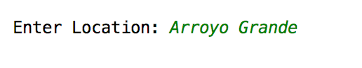
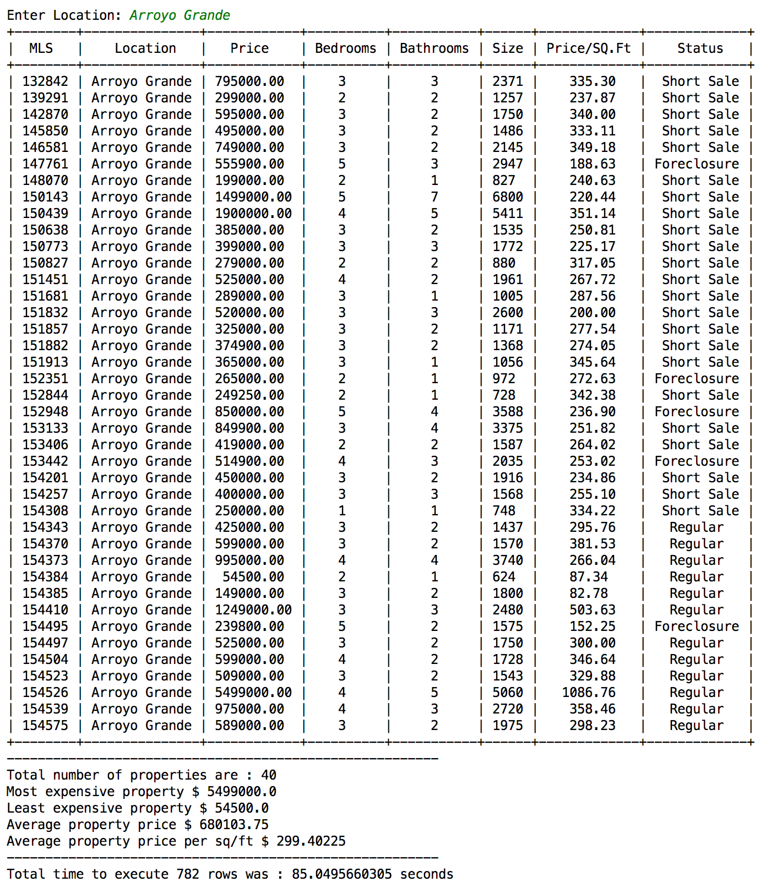
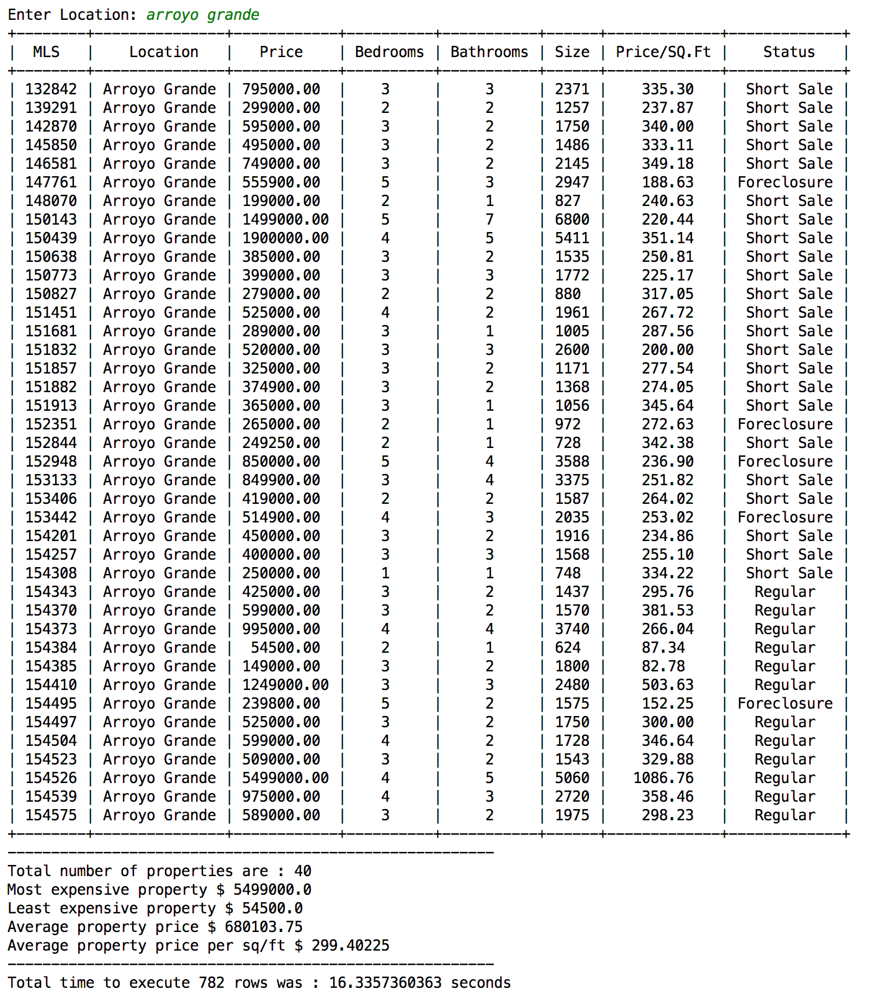
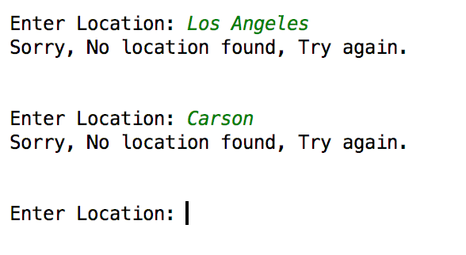
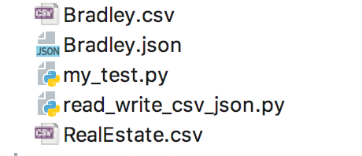
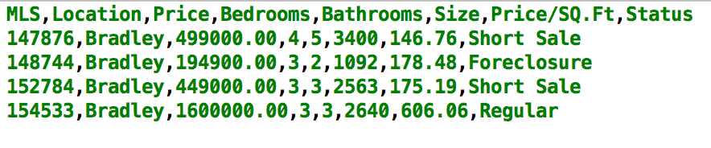
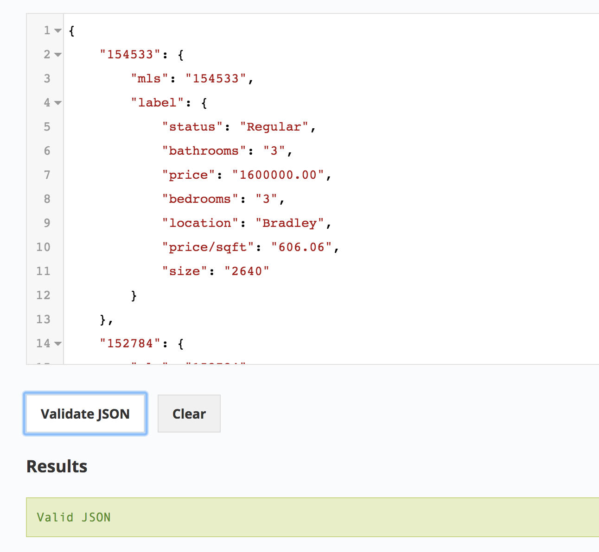
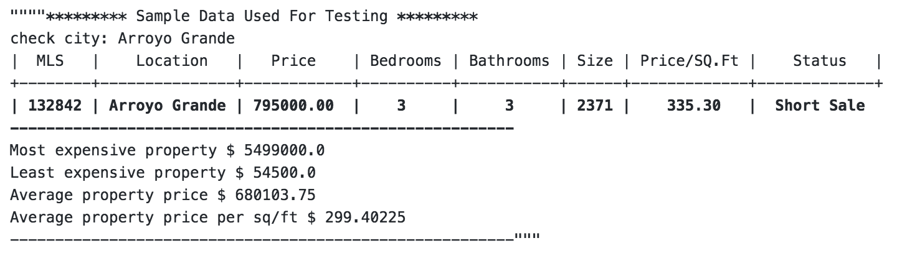

# read_write_csv_json
This program will get the user input location and display the output if found any match is csv file. If match found, it will create the csv and the json file for that particular location, otherwise keep asking to enter a valid location.

## Objective:

* Find the 'Location' from user input and search the match from given CSV file and group by the city name, price, Bedrooms,Bathrooms,Size,Price/SQ.Ft,Status.
* Display the resultant data in tabular form.
* Find and display the total number of properties, most expensive property, Least expensive property, average property price and average property price per sq/ft in a matched result.
* Calculate and display the execution time and the total number of rows in the CSV file.
* If found a matching location, create a csv and json files for that particular location.

# ----------- Demo --------------

### User input requested for 'Location'.

### Display result if any matching location found.

### Will convert lower case input into upper and display same result.

### Display error message if no location found.

### If any match is being found, create CSV and Json files for that particular location.

### Resultant CSV file.

### Resultant Json file.

# ------------ Unittest -----------------
## my_test.py

Run command $ python my_test.py

Than, enter the location defined in sample data, in this case city_name='Arroyo Grande'

